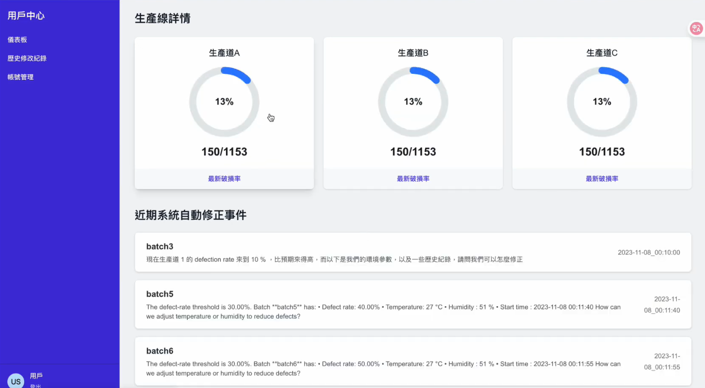

# PILL DEFECT DETECTION AND MONITORING SYSTEM


A production monitoring system designed for pill manufacturing. This system leverages [ICAM](https://www.advantech.com/en/products/ce666c81-b9fc-4675-b7aa-0c16ce758636/icam-540/mod_090d1ba9-cea5-4fb1-98ab-9029aeb0a7e7) for real-time defect detection and defection rate calculation
<p align="center">
  
  
</p>

## Features

- Real-time monitoring of pill production lines
- Automatic detection and calculation of defected pills using ICAM
- Visualization of defection rates and production statistics
- Event logs and AI suggestions for process improvement
- Admin dashboard for batch and event management

## Getting Started

### Prerequisites

- Node.js (v18 or above)
- npm or yarn

### Installation

1. Clone the repository:
    ```bash
    git clone https://github.com/your-org/medicine_recognition.git
    cd medicine_recognition
    ```

2. Install dependencies:
    ```bash
    npm install
    # or
    yarn install
    ```

3. Set up environment variables:  
   Copy `.env.example` to `.env.local` and fill in your AWS and other required credentials.

### Running the App

```bash
npm run dev

```

The app will be available at [http://localhost:3000](http://localhost:3000).
If you do not want to clone it, you can also access the Website  at [https://medicine-recognition-bhs5.vercel.app/](https://medicine-recognition-bhs5.vercel.app/)

## Usage

- **Login** with your admin credentials.
- **Dashboard**: View real-time statistics and recent events.
- **Events**: Click on any event to see detailed analysis and AI recommendations.
- **Batch Management**: Review historical batches and their defect rates.
- **AI Suggestions**: Get actionable insights to improve production quality.

## Project Structure

- `/src/component` - React components for UI
- `/src/app/api` - API routes for data fetching and processing
- `/public` - Static assets

## Technologies Used

- Next.js (App Router)
- React
- Tailwind CSS
- AWS S3 (for event and batch data)
- AWS bedrock
- AWS IAM
- AWS Lambda
- ICAM (for image capture and analysis)

## License

MIT
